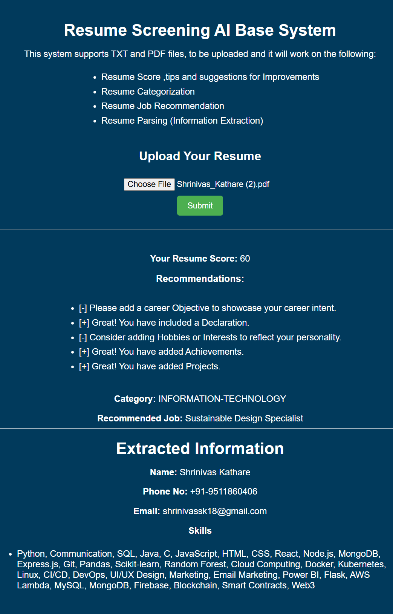

# Resume Screening AI-Based System

This project is an AI-powered system designed to automate the process of screening resumes. It supports both TXT and PDF file formats and performs multiple tasks, including resume scoring, categorization, job recommendations, and parsing information.



## Features

- **Resume Scoring**: The system analyzes the content of a resume and assigns a score based on the presence of important sections like "Objective," "Declaration," "Hobbies," "Achievements," and "Projects."
- **Resume Writing Tips & Suggestions**: Provides personalized recommendations to improve the quality of resumes based on their content.
- **Resume Categorization**: Classifies resumes into predefined categories (e.g., software developer, data scientist) using machine learning models.
- **Job Recommendation**: Recommends suitable job roles based on the resume's content and career level.
- **Resume Parsing**: Extracts essential information from resumes (like name, email, skills, education, etc.) for further processing or job matching.

## Technologies Used

- **Python**: Primary programming language
- **Machine Learning**: 
    - scikit-learn for model building
    - Natural Language Processing (NLP) for text analysis
- **PDF Parsing**: PyPDF2 for extracting text from PDF resumes
- **Flask**: For building the web interface
- **HTML, CSS**: For front-end presentation
- **Other Libraries**: 
    - re (Regular Expressions) for text cleaning
    - pickle for model serialization

## Setup and Usage

1. Clone the Repository:

-  ```git clone https://github.com/shrinivask007/Ai-resume-screening.git ```
-  ```cd Ai-resume-screening ```

2. Run the Flask Web Application:
```python app.py```

3. Upload a Resume:

- Visit the application in your web browser.
- Upload a TXT or PDF file containing a resume.
- Click On Submit Button

4. View Results:
- The application will display the score, tips for improvement, and recommended job categories.

## How It Works
- **Resume Upload**: Users upload a resume (TXT or PDF) via the web interface.
- **Text Extraction**: The system extracts text from the uploaded file (supports both TXT and PDF).
- **Resume Scoring**: It scores the resume based on the presence of key sections.
- **Recommendations**: Personalized recommendations are provided to improve the resume.
- **Categorization**: The resume is classified into a category using machine learning models.
- **Job Recommendation**: Based on the resume's content, suitable job roles are suggested.
- **Parsing**: The system extracts key details such as name, email, skills, and education for further analysis.